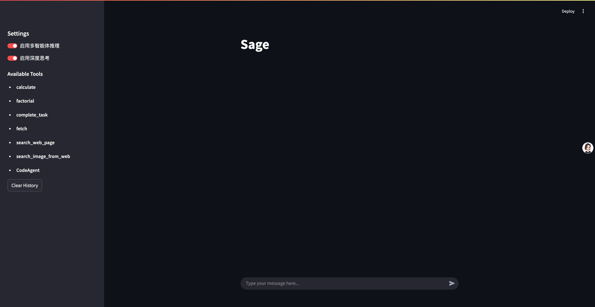

[](README.md)
[](README_CN.md)

# Multi-Agent System Framework

A modular framework for building multi-agent systems with two distinct approaches:
1. **Deep Research Mode**: Comprehensive multi-agent collaboration for complex problem solving
2. **Rapid Execution Mode**: Lightweight agents optimized for fast task completion

Provides capabilities for task decomposition and execution in both modes.

## Features

- **Agent Pipeline**: Task analysis → Planning → Execution → Observation → Summary
- **Tool System**: Extensible tool integration with automatic registration
- **MCP Server Support**: Manage external tools via MCP servers
- **Message Flow**: Structured message passing between agents  
- **Modular Design**: Easy to extend with new agents and tools

## Installation

```bash
git clone https://github.com/ZHangZHengEric/Sage.git
cd Sage
pip install -r requirements.txt
```

## MCP Server Setup

To use MCP servers with external tools:

1. Install required dependencies:
```bash
pip install uvicorn
```

2. Start the MCP servers:
```bash
bash mcp_servers/run_all_mcp_server.sh
```

3. Configure servers in `mcp_servers/mcp_setting.json`:
- Set `disabled: false` for servers you want to use
- Configure API keys and endpoints as needed

The system will automatically discover and register tools from running MCP servers.

## Examples

Run the web demo:
```bash
streamlit run sage_demo.py -- --api-key your_api_key --model deepseek-chat --base-url https://api.deepseek.com/v1
```



## Architecture

```mermaid
graph TD
    A[User Input] --> B(TaskAnalysisAgent)
    B --> C{Task Analysis Complete?}
    C -->|Yes| D[PlanningAgent]
    C -->|No| B
    D --> E[ExecutorAgent]
    E --> F[ObservationAgent]
    F --> G{Task Complete?}
    G -->|Yes| H[TaskSummaryAgent]
    G -->|No| D
    H --> I[Final Output]
    
    subgraph Tool Execution & Observation 
        E --> J[ToolManager]
        J -->|Use| K[Local Tools]
        J -->|Use| L[MCP Servers]
        L --> M[External Tools]
        K --> N[Tool Results]
        M --> N
        N --> F[ObservationAgent]  
        F -->|Feedback| E  
    end
```

## Core Components

### Agents

- **AgentController**: Main entry point for user requests
- **AgentBase**: Base class for all agents
- **TaskAnalysisAgent**: Analyzes and understands user requirements
- **PlanningAgent**: Plans subtasks and dependencies  
- **ExecutorAgent**: Executes subtasks using tools
- **ObservationAgent**: Monitors task progress
- **TaskSummaryAgent**: Generates final output summary

### Tools System

- **ToolBase**: Interface for all tools
- **ToolManager**: Manages tool registration and discovery
- **MCP Server Integration**: Register and manage external tools via MCP protocol
- **WebSearchTool**: Example web search tool
- **CalculationTool**: Example calculation tool

#### MCP Server Support
ToolManager can register and manage tools provided by MCP servers:
- Supports both stdio and SSE connection modes
- Automatic tool discovery and registration
- Seamless integration with ExecutorAgent

## Message Format

Messages follow a structured format with types:
- `normal`: Regular conversation messages
- `thinking`: Intermediate thought process

Example flow:
```json
{"role":"user","content":"User request","type":"normal"}
{"role":"assistant","content":"Response","type":"normal"}
{"role":"assistant","content":"Thinking about task","type":"thinking"}
{"role":"tool","content":"Thought result","type":"thinking"}
```

## Directory Structure

```
agents/
    agent/
        agent_controller.py
        agent_base.py
        task_analysis_agent/
        planning_agent/ 
        executor_agent/
        observation_agent/
        task_summary_agent/
    tool/
        tool_base.py
        tool_manager.py
        calculation_tool.py
examples/
    sage_demo.py
```

## Contributing

1. Fork the repository
2. Create a new branch 
3. Submit a pull request


## License

MIT

## Roadmap

1. **Tool System Enhancements**: Improve and design more comprehensive MCP server support
2. **Logger Optimization**: Enhance logging functionality and output formatting  
3. **Supported Models**: Maintain and expand the list of tested and supported AI models
4. **Infinite Context**: Support for ultra-long and complex tasks
5. **Professional Agents**: Expand collection of specialized agents

欢迎加我微信入群交流 微信号是 zhangzheng-thu
